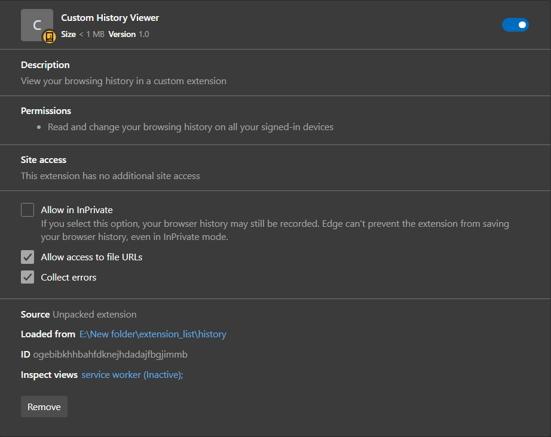

  

<h1 align="center">History Viewer Extension</h1>

A modern browser history viewer for Microsoft Edge and Google Chrome using Bootstrap 5.

---

## 📸 Screenshots

  

---

## 🚀 Features ✅

- 🔎 Search browser history instantly
- 🌐 Website favicon icons
- 🎨 Bootstrap 5 user interface
- 📱 Responsive layout
- ⚡ Fast and lightweight
- 🖥 Compatible with Microsoft Edge & Google Chrome

---

## 🛠 Technologies Used

- JavaScript
- Bootstrap 5
- Bootstrap Icons
- Chrome Extension API
- Edge Extension API

---

## 📂 Installation (Developer Mode)

### Microsoft Edge

1. Open `edge://extensions/`  
2. Enable **Developer mode**  
3. Click **Load unpacked**  
4. Select the extension folder  

### Google Chrome

1. Open `chrome://extensions/`  
2. Enable **Developer mode**  
3. Click **Load unpacked**  
4. Select the extension folder  

---

## 🌐 Supported Browsers

- Microsoft Edge (Chromium-based)  
- Google Chrome  

---

## 📦 Release Downloads

You can download the ready-to-install ZIP version from the **Releases** tab:  
[Download v1.0.0](https://github.com/attendance1978-wq/history/releases/tag/v1.0.0)

---

## 🤝 Contribution

1. Fork the repository  
2. Create a feature branch: `git checkout -b feature-name`  
3. Commit your changes: `git commit -m "Add feature"`  
4. Push to the branch: `git push origin feature-name`  
5. Open a Pull Request  

---

## 📄 License

This project is licensed under the **MIT License** – see the [LICENSE](LICENSE) file for details.

---
